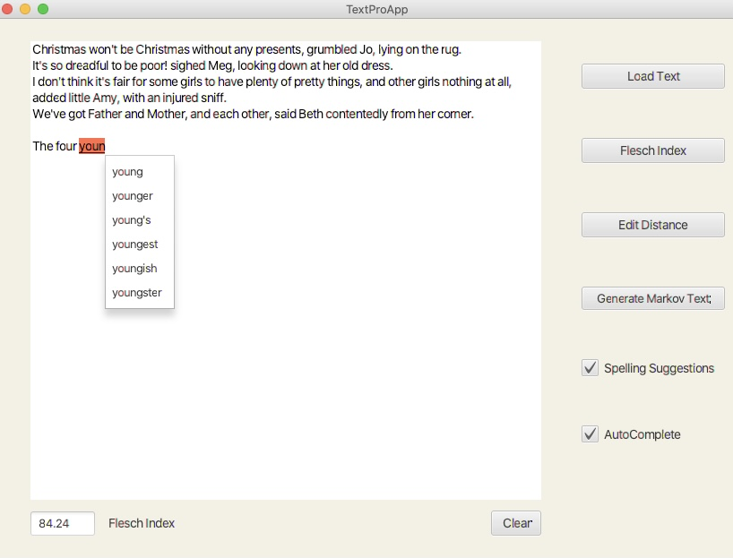
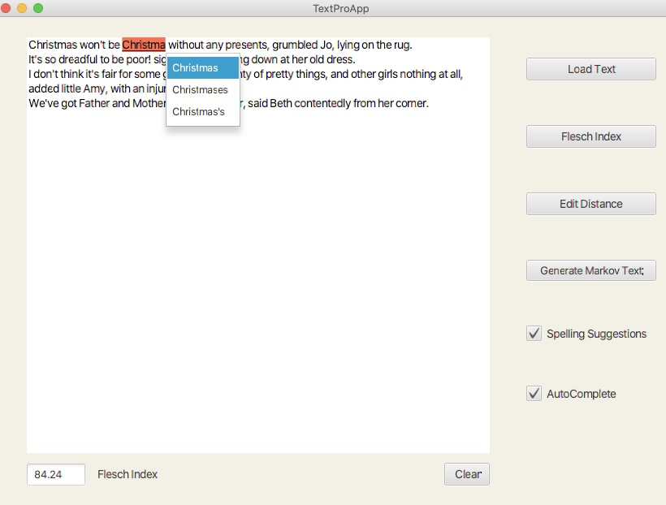

## Project for the course Data structures: Measuring and Optimizing Performance

Implemented the back end of a text editor, complete with spelling check, spelling suggestions, auto complete and computation of the Flesch Index of the text.

